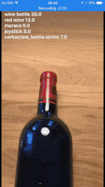

# Getting started

Click [here](https://www.youtube.com/watch?v=S33BNcnlxdU) for a better demo.

You can find a detailed breakdown of the code here: https://blog.cmgresearch.com/2017/06/22/vision-kit-and-coreml.html

You will need the beta version of xCode and a device running the iOS 11 beta (make sure you only install the beta software on a test device!).

### CoreML Model

~~If you have [Git LFS](https://git-lfs.github.com) installed, the required CoreML will download as part of the git clone. Otherwise you can download the CoreML model - Resnet50.mlmodel from here:~~

Unfortunately we've had to remove the model from Git LFS as we were running out bandwidth!

You can download the CoreML model - Resnet50.mlmodel from here:

[https://developer.apple.com/machine-learning/](https://developer.apple.com/machine-learning/) and drag the downloaded file into your project. Make sure you click on the "copy" checkbox.

